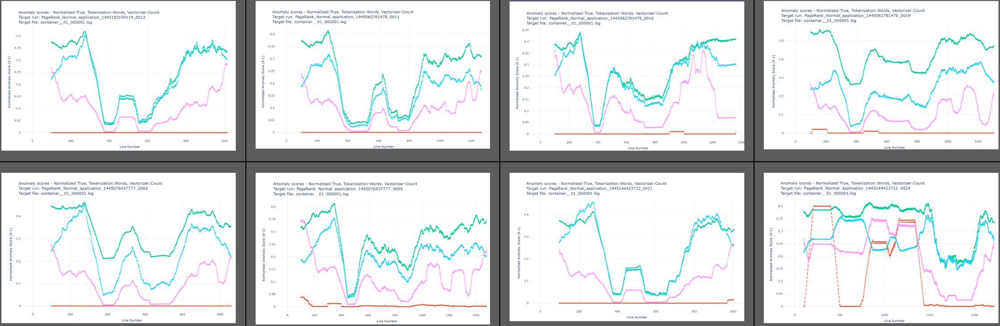

# LogDelta
LogDelta - Go Beyond Grepping with NLP-based Log Analysis! 

See [YouTube](https://www.youtube.com/playlist?list=PLTUjKYPvVhe6JhHBlkJN_yPhVDR5w2ej2) demonstrating the tool in action.

## Installation and Example
We recommend using a virtual environment to avoid compatibility issues.
```bash
conda create -n logdelta python=3.11
conda activate logdelta
```
Install logdelta. 
```bash
pip install logdelta
```
Download source code, and navigate to demo folder
```bash
git clone https://github.com/EvoTestOps/LogDelta.git
cd LogDelta/demo
```
Get data
```bash
wget -O Hadoop.zip https://zenodo.org/records/8196385/files/Hadoop.zip?download=1
unzip Hadoop.zip -d Hadoop
```
Run analysis
```bash
python -m logdelta.config_runner -c config.yml`
```
Observer results in `LogDelta/demo/Output`. For more examples see `LogDelta/demo/label_investigation` and `LogDelta/demo/full`


LogDelta assumes your folders represent a collection of software logs of interest. LogDelta performs a comparison between two or more folders using matching file names.  A **target run** represents a software run we are interested in analyzing. LogDelta uses **comparison runs** as a baseline. For example, the "My_passing_logs1", "My_passing_logs2", "My_passing_logs3" folders can be comparison runs, while "My_failing_logs" would be your target run that you want to analyze with respect to comparison runs.


## Types of Analysis
In LogDelta, three types of analysis are available:

1. **Visualize** 
   - Multiple logs files or runs with UMAP based on two dimensional scaling of the log contents. 
   - Individual log files with log anomaly scoring (see step 3 for details anomaly detection supported)

2. **Measure the distance between two logs or sets of logs** using:
   - Jaccard distance
   - Cosine distance
   - Containment distance
   - Compression distance

3. **Build an anomaly detection model** from a set of logs and use it to score anomalies (higher scores more anomalous) in a log file using :
   - KMeans (kmeans)
   - IsolationForest (IF)
   - RarityModel (RM)
   - Out-of-Vocabulary Detector (OOVD)


## Levels of Analysis
Analysis can be done at four different levels:

1. **Run (folder) level**, investigating the names of files without looking at their contents.
2. **Run (folder) level**, investigating run contents (this is slower than what is done in 1).
3. **File level**, investigating file contents (matched with the same names between runs).
4. **Line level**, investigating line contents (matched with the same names between runs).


LogDelta is build on top of LogLead[^1]. https://pypi.org/project/LogLead/

Log line level anomaly detection visualized. Which one is anomaly? 



[^1]: Mäntylä MV, Wang Y, Nyyssölä J. Loglead-fast and integrated log loader, enhancer, and anomaly detector. In2024 IEEE International Conference on Software Analysis, Evolution and Reengineering (SANER) 2024 Mar 12 (pp. 395-399). IEEE.
