# LogDelta Demo
Hello, and welcome to this video! Today, we’ll explore how to analyze logs using the LogDelta tool. For this demonstration, we’re using data derived from two notable papers.

The original dataset comes from the 2016 paper "Log Clustering-Based Problem Identification for Online Service Systems", published in ICSE [^1]. This data has since been republished as part of the Log Hub Log Data Collection Set [^2], making it widely accessible for research and experimentation.

[^1]: Qingwei Lin, Hongyu Zhang, Jian-Guang Lou, Yu Zhang, Xuewei Chen. *Log Clustering Based Problem Identification for Online Service Systems*. International Conference on Software Engineering (ICSE), 2016.

[^2]: Jieming Zhu, Shilin He, Pinjia He, Jinyang Liu, Michael R. Lyu. *Loghub: A Large Collection of System Log Datasets for AI-driven Log Analytics*. IEEE International Symposium on Software Reliability Engineering (ISSRE), 2023.

In this video, we’ll focus exclusively on the PageRank application from the dataset. While the dataset also includes a separate application—WordCount—that could be analyzed in a similar manner, we will leave that for a potential future investigation.

## Setup
To get started, we’ll begin by setting up LogDelta for our analysis. First, install LogDelta using pip. Next, clone the LogDelta repository from GitHub.
After cloning the repository, navigate to the logdelta demo label-investigation folder. Finally, download the Hadoop dataset and extract its contents into the working folder. With these steps completed, we’re ready to dive into the analysis.

The Hadoop dataset includes labels in a separate file for the different runs we plan to analyze. To make this analysis compatible with LogDelta’s philosophy, it’s a good idea to rename the existing runs or folders using these label names. To assist with this, we provide a script that automates the renaming process, ensuring the labels are clearly associated with each run. This makes the analysis phase much more easier to follow.

```bash
pip install logdelta
git clone https://github.com/EvoTestOps/LogDelta.git
cd LogDelta/demo/label_investigation
wget -O Hadoop.zip https://zenodo.org/records/8196385/files/Hadoop.zip?download=1
unzip Hadoop.zip -d Hadoop
python label_hadoop_runs_orig.py
```

## Visualization 

### Visualization based on file names. 
This is the most top level analysis. It is specified in file `1_viz_file_names.yml`. To get results execute `python -m logdelta.config_runner -c 1_viz_file_names.yml`. Output is in `out_1` folder.

Simple plot show runs with two axis the number of log lines in Y-axis the runs and number of unique file names in X-axis. Number of loglines in runs can be usefull as anomolous runs are often smaller or larger than normal run. 

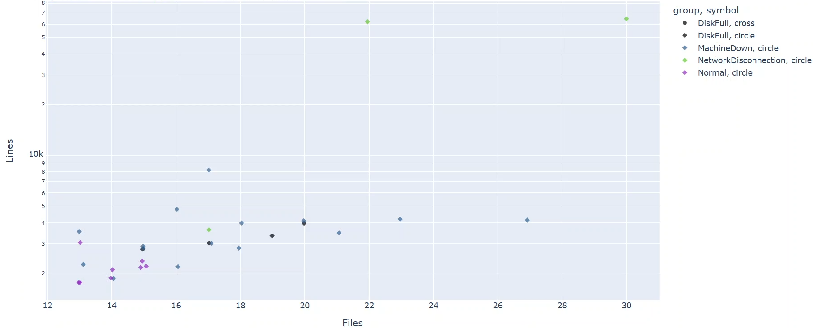

For example paper by Landauer et al[^3] showed that one third of anomaly seqeuences in HDFS data set can be recognized by the fact that they shorter than any of the normal runs. 

[^3]: Landauer M, Skopik F, Wurzenberger M. A critical review of common log data sets used for evaluation of sequence-based anomaly detection techniques. Proceedings of the ACM on Software Engineering. 2024 Jul 12;1(FSE):1354-75.

For our Hadoop dataset, we can observe on the Y-axis that normal executions have a maximum of roughly 3,000 log lines. Additionally, the number of unique log file names, shown on the X-axis, can be particularly useful for analyzing large applications that produce multiple log files. Anomalous conditions might exhibit a larger or smaller number of unique log files compared to normal runs. In our case, normal executions have a maximum of about 15 unique log files.

Based on this straightforward analysis, we can define boundaries to classify anomalies. Specifically, any run with more than 15 files or more than 3,000 log lines would be considered anomalous. From the dataset, we have 29 runs in total, 8 of which are labeled as normal. When we zoom into the defined boundaries, we find 13 runs within the box—5 labeled as anomalies and the remaining 8 as normal. This simple approach achieves a roughly 76% accuracy in identifying anomalies, successfully detecting 16 out of 21 anomalies.

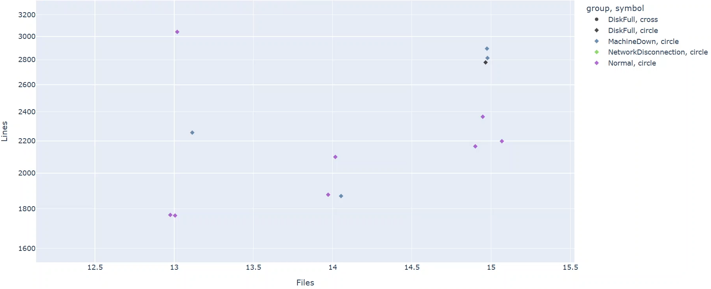


### Visualization based on textual content.
#### Simple plot
Previously, we focused solely on investigating log file names. Now, we’ll analyze the actual textual content within the runs. This analysis is specified in the file `2_viz_run_content.yml`. To generate the results, execute the command: `python -m logdelta.config_runner -c 2_viz_run_content.yml`
The output will be saved in the `out_2` folder. 

We’ll continue by examining the output, starting once again with the Simple Plot. This plot shows the runs with two axes: the number of log lines on the Y-axis and the number of unique terms on the X-axis. When we refer to terms, we mean words or tokens. LogDelta provides several methods for splitting text into terms.

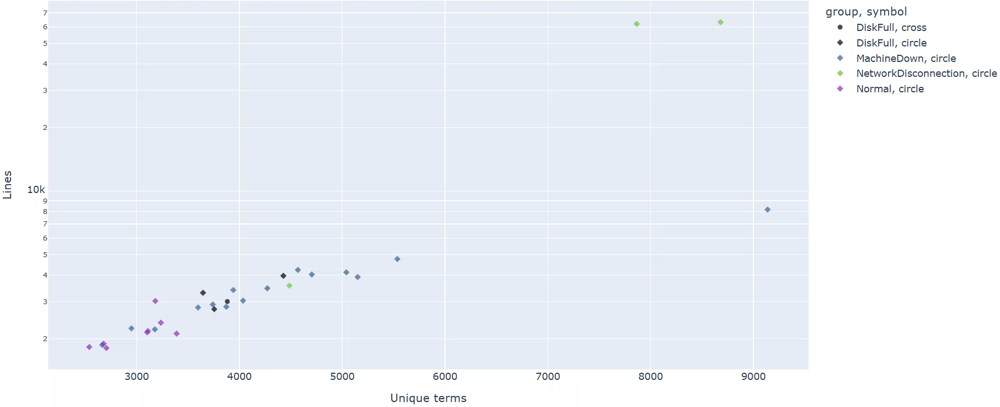

Since the Y-axis remains the same as in the previous analysis, we can reuse the boundary of 3,000 log lines to classify a run as anomalous. On the X-axis, we observe that a reasonable boundary for unique terms could be set at 3,400 terms.

When we zoom inside the box defined by these boundaries—3,000 log lines and 3,400 terms—we find all 8 normal cases and only 3 anomalies. In other words, this approach performs slightly better than the previous one, as it can now correctly classify approximately 86% of anomalies, successfully identifying 18 out of 21.

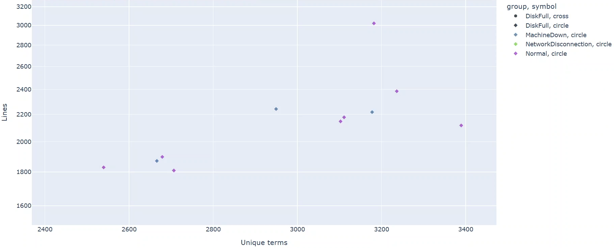


Simple Plot file level:
  - Boundary X=15 files Y=~3000 lines
  - Inside box: 8/13 (62%) are Normal
  - Outside box: 16/16 (100%) are Anomalies

|                       | Inside Box (Predicted Normal) | Outside Box (Predicted Anomalies) |
|-----------------------|-------------------------------|-----------------------------------|
| **Normal**       | 8 (true normal)               | 0 (false anomaly)                 |
| **Anomaly**      | 5 (false normal)              | 16 (true anomaly)                 |

Simple Plot textual content level:
  - Boundary X=3,400 unique terms Y=~3000 lines
  - Inside box: 8/11 (72%) are Normal
  - Outside box: 18/18 (100%) are Anomalies

|                       | Inside Box (Predicted Normal) | Outside Box (Predicted Anomalies) |
|-----------------------|-------------------------------|-----------------------------------|
| **Normal**       | 8 (true normal)               | 0 (false anomaly)                 |
| **Anomaly**      | 3 (false normal)              | 18 (true anomaly)                 |


#### U-MAP
Now, we turn our attention to the U-MAP plot, which is also produced in the previous run. U-MAP operates on the Document-Term Matrix, where log files are treated as documents, and terms are derived based on the word splitting applied during preprocessing.
For example, the Document-Term Matrix includes the following details:
| Log-file  | IP | address | is | ... |
|-----------|----|---------|----|-----|
| Log-file1 | 2  | 4       | 3  |     |
| Log-file2 | 0  | 3       | 5  |     |
| Log-file3 | 1  | 0       | 9  |     |
| ...       |    |         |    |     |
- Log-file1: Contains the term "IP" 2 times, the term "address" 4 times, and the term "is" 3 times.
- Log-file2: Does not contain the term "IP," but the term "address" appears 3 times, and the term "is" appears 5 times.
- Log-file3: Contains the term "IP" once, does not include the term "address," and has the term "is" 9 times.

On the screen, we have three different U-MAP visualizations, generated by executing the script three times. U-MAP visualizations will vary between executions because compressing multidimensional space into two-dimensional space depends on a random seed that changes with each run. This variability makes it important to perform multiple runs and compare the outputs to evaluate how consistent and repeatable the observed patterns are.

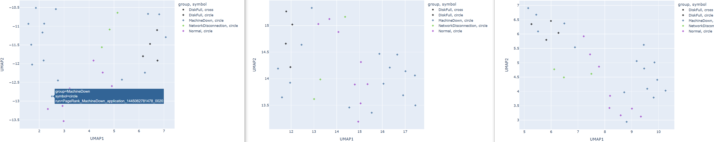

We can also apply the boxing strategy here, where we use the boundaries on the Y and X axes of the normal cases to draw a box. Everything inside the box is classified as normal, while anything outside is considered anomalous. 

On the first U-MAP, we can see the drawn box on the screen. Within this box, there are 10 items, of which only two are anomalies. Moving on to the second U-MAP, applying the boxing strategy shows three anomalies inside the box, which still manages to cover all eight normal cases. This result is consistent with the previous result we got using simple map. Finally, in the third U-MAP, the box again captures all the normal cases and includes only two anomalies.

As shown on screen, it appears that the boxing strategy applied to U-MAP is slightly better than using boxing strategy on simple maps. 

Results – Umaps with boundaries

UMAP1:
  - Inside box: 8/10 (80%) are Normal
  - Outside box: 19/19 (100%) are Anomalies

|                       | Inside Box (Predicted Normal) | Outside Box (Predicted Anomalies) |
|-----------------------|-------------------------------|-----------------------------------|
| **Normal**       | 8 (true normal)              | 0 (false anomaly)                |
| **Anomaly**      | 2 (false normal)             | 19 (true anomaly)                |

UMAP2
  - Inside box: 8/11 (72%) are Normal
  - Outside box: 18/18 (100%) are Anomalies

|                       | Inside Box (Predicted Normal) | Outside Box (Predicted Anomalies) |
|-----------------------|-------------------------------|-----------------------------------|
| **Normal**       | 8 (true normal)              | 0 (false anomaly)                |
| **Anomaly**      | 3 (false normal)             | 18 (true anomaly)                |

UMAP3
  - Inside box: 8/10 (80%) are Normal
  - Outside box: 19/19 (100%) are Anomalies

|                       | Inside Box (Predicted Normal) | Outside Box (Predicted Anomalies) |
|-----------------------|-------------------------------|-----------------------------------|
| **Normal**       | 8 (true normal)              | 0 (false normal)                 |
| **Anomaly**      | 2 (false normal)             | 19 (true anomaly)                |

#### Suspicious Labels
However, at this point, I’m starting to grow suspicious of the run `Machine_Down_application_1445062781478_0020`.  In U-Map 1, it appears inside the box of normal points. Note that on the screen, I’ve zoomed into the boxes for better visibility. In U-Map 2, we see that this run is just outside the box boundary. Meanwhile, in U-Map 3, it is back inside the box. For visual check the [video](https://youtu.be/O2_M8NCpbsE?t=315) - the timestamp points to correct location. 

Looking at the previous plots, we notice some inconsistency as well. In the Simple Plot with textual content, the run is inside the box. However, in the Simple Plot with file names, it is outside the box.

#### Summary
To summarize, the high-level visualization approach using boxes seems to yield fairly good results. However, we have some questions regarding the correctness of the labels. That said, we cannot make such decisions solely based on these high-level plots. We will proceed with more detailed analysis in the next videos to investigate further.

## Anomaly Detection

### Anomaly Detection with Run Content
We now move on to building an anomaly detection model using the textual content of the runs. To train the model, we use only the normal runs. Once the model is trained, we test it against all runs, including the normal ones. When testing a normal run, LogDelta automatically excludes that specific run from the training data. This ensures that the same run is not used for both training and testing, preventing biased results.

This analysis is specified in the file `3_ano_run_content.yml`. To generate the results, execute the following command: `python -m logdelta.config_runner -c 3_ano_run_content.yml`. The output will be saved in the `out_3` folder. 

The output of this process is a Microsoft Excel spreadsheet. If you prefer, you can generate a CSV output instead by modifying the YAML configuration file. The spreadsheet output includes scores from multiple anomaly detection methods. These include two well-known general-purpose anomaly detection methods K-Means and Isolation Forest, as well as two custom algorithms we’ve developed: the Out-of-Vocabulary Detector and the Rarity Model.

For more details about these custom models and their evaluation against the established general-purpose anomaly detection methods, see our paper [^4].

[^4]: Nyyssölä J, Mäntylä M. Speed and Performance of Parserless and Unsupervised Anomaly Detection Methods on Software Logs. In2024 IEEE 24th International Conference on Software Quality, Reliability and Security (QRS) 2024 Jul 1 (pp. 657-666). IEEE.

For summarization, we provide two scores. Z-score that scales each anomaly score and offers a combined metric. However, we recommend using the rank sum for sorting, as some metrics can be highly distorted and may disproportionately influence the z-score. The rank sum is simply the sum of the ranks across all metrics for each run. With four metrics, the lowest possible rank sum is 4, indicating that the run has the lowest rank in all anomaly metrics. Lower scores always indicate less anomalous behavior.

If we sort the runs by rank sum, we identify three suspicious cases (in bold). 
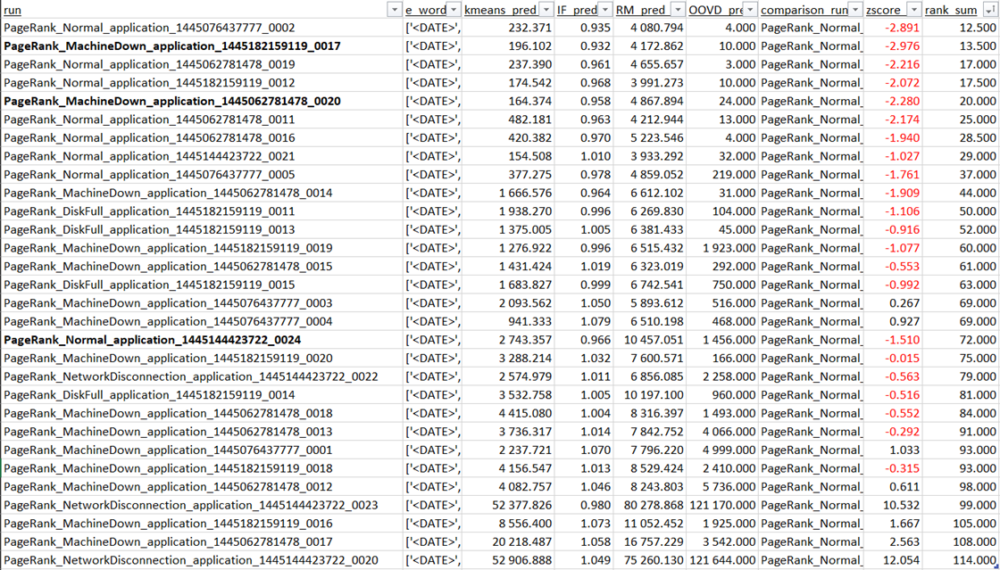
Ideally, we would expect the top of the rank sum list to be dominated by normal runs. However, we notice two machine-down runs among the lowest-ranking runs. One of these is `PageRank_MachineDown_application_1445062781478_0020`, which we previously flagged as suspicious. The other case is `PageRank_MachineDown_application_1445182159119_0017`, which seems even more similar to normal runs than the first. 

These are the first two cases of suspected incorrect labels. Additionally, we identify a third suspicious case: `PageRank_Normal_application_1445144423722_0024`. When sorted by rank sum score, this run should be grouped with the other normal runs, but it is not. This suggests that it behaves anomalously compared to the actual normal runs, raising questions about the correctness of its label.

In this video, we demonstrated how to develop an unsupervised anomaly detection model using normal runs data. When sorting by anomaly scores, most of the least anomalous cases were normal runs. However, three suspicious cases were identified: two where an anomalous label is suspected to be normal, and one normal case that is suspected to be anomalous.

### Anomaly Detection with Log Line Level Model
Next, we analyze each log line in isolation and assign an anomaly score to each line. LogDelta provides these line-level anomaly scores as Excel or CSV-files. However, a practical starting point is to use visualizations. These visualizations create a unique "fingerprint" for each run, making it easier to identify deviations. On the screen, you can see both a spreadsheet of log lines and a visualization of log lines.
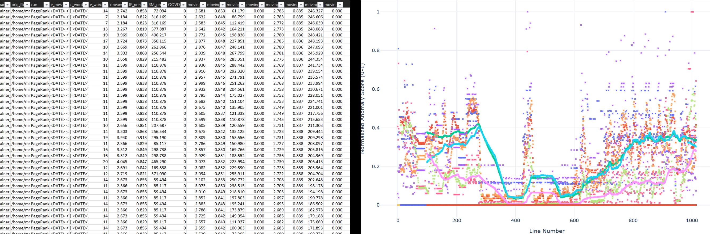

It is important to highlight the distinction from the previous video. In that approach, we evaluated the entire textual content of a run and assigned an anomaly score to the run as a whole. In contrast, this line-by-line approach focuses on individual log lines. The difference is notable: the previous model answers the question, "Is this entire run anomalous?" whereas this model answers, "Is this specific log line anomalous?" The advantage of the line-by-line approach is its ability to pinpoint exactly which lines are anomalous, providing more detailed insights into the data.

This model is specified in the file `4_ano_line_content.yml`. For line-level predictions, we need to select a specific log file to analyze. In this case, we build and test models using the main log file, `container__01_000001.log`, from all runs. This log file is the largest for each run and can be considered the main log that spawns worker processes. To generate results, execute the command: `python -m logdelta.config_runner -c 4_ano_line_content.yml`. The output will be saved in the `out_4` folder.  

Now we have the results. Lets open one run line-by-line visualization log labeled as Normal, namely `PageRank_Normal_application_1445182159119_0012`,  to explain what is visualized. 
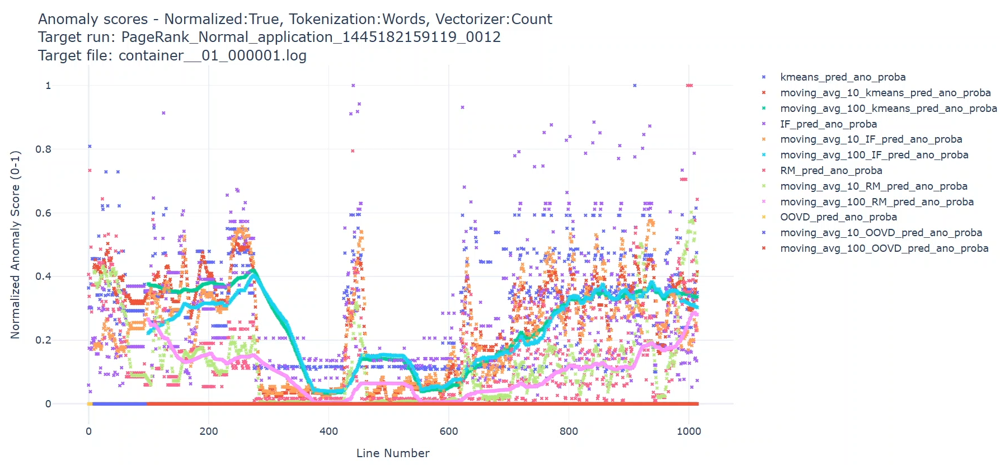

First, X-axis corresponds to the line number while Y-axis shows the anomaly scores. Anomalies are scored with the four anomaly detection models Kmeans, Isolation Forrest, Rarity Model, and Out Of Vocabulary Detector. We have also added their moving averages over 10 and 100 log lines. All anomaly scores have been normalized from 0 to 1. Otherwise reading this would be impossible as each anomaly detection method score anomalies differently. 

It is a good idea to check each anomaly model’s scores individually first.   We can observe that K-means and Isolation Forest show more fluctuation in their scores compared to the Rarity Model. Additionally, we notice that the Out-of-Vocabulary Detector does not detect any out-of-vocabulary terms in this file, as it assigns a score of zero to every line. For visual check the [video](https://youtu.be/KTVNrmK8FN0?t=196) - the timestamp points to correct location. 

We can check out some individual points. Moving the mouse over a point brings up a tooltip that displays the log line in more detail. Examining a few points reveals that the higher-scoring log lines do not appear to be particularly alarming.  

Looking at the moving averages, we see that the Isolation Forest and K-means models give this run almost identical scores. The Rarity Model is somewhat different, although it shares some similarities with the patterns from K-means and Isolation Forest. However, the Out-of-Vocabulary Detector consistently scores zero, providing a clearly distinct pattern.  

### Comparing Line-by-Line Finger Prints

#### Investigating all Normal runs

Now, we can use a 100-line moving average as our pattern and check if the other normal runs show similar behavior. In total, we have 8 runs labeled as normal to compare.  Do any of the normal runs look noticeably different from each other? It might be challenging to identify a clear pattern without examining them side-by-side.  

Here is an image. 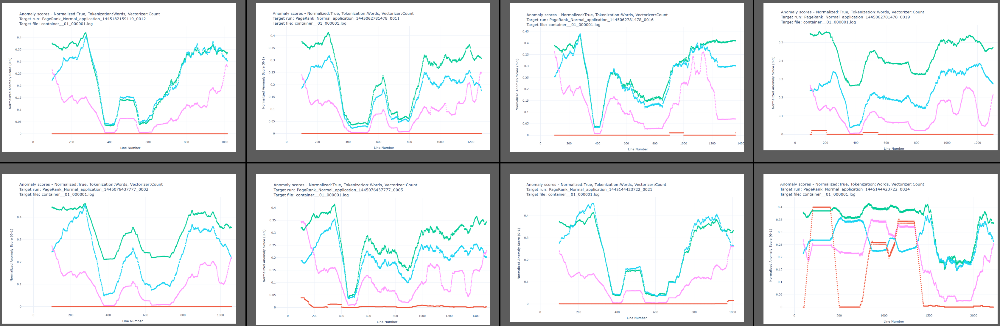
Now it becomes much easier to identify which pattern doesn’t belong or looks too different. The answer is clear: the one on the bottom right.  In addition to the shape being different, the X-axis label reveals that this log file is significantly longer than the others, extending well past 2,000 lines. In contrast, the second-longest log only surpasses 1,400 lines.  This log file is from the run we previously identified as suspicious. That is the run `PageRank_Normal_application_1445144423722_0024`

We can create another fingerprint or pattern comparison by selecting all the raw values. When we arrange all 8 runs side-by-side, it looks similar to the previous comparison identifying bottom right is being different.   

Now, let’s take a closer look at this highly suspicious normal execution. First, we clear out the moving averages and focus on individual line-by-line scores.  Hovering over the most anomalous points reveals a recurring issue: a lack of disk space. This is indicated by the log message stating, *"Going to preempt 1 due to lack of space for maps."* This provides strong evidence that this run is experiencing a Disk Full anomaly. For visual check the [video](https://youtu.be/2GWZob7K5h0?t=102) - the timestamp points to correct location. 

On screen, we have a refresher from the previous video, displaying the results from run-level anomaly scoring. Notably, the same run is identified as anomalous here, with a significantly high rank-sum score. It stands out as being ranked far from the normal runs and is surrounded by other anomalous runs.

Here is a summary table of the identified incorrect labels and their corresponding fixes. The table outlines three key details: the run ID, the original label, and the corrected label.

| ID                 | Original Label | Fixed Label |
|---------------------|----------------|-------------|
| 1445144423722_0024 | Normal         | Disk Full   |

#### Investigate all Machine Down Anomalies
Now, let’s move on to studying Machine Down anomalies. There are 15 such anomalies, each exhibiting distinct fingerprints, as shown on the screen.
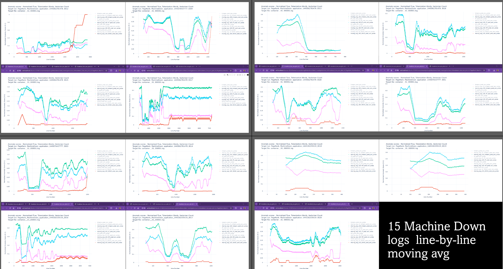
 These variations suggest that the specific machine involved or the timing of the anomaly injection procedure plays a significant role in shaping the resulting anomaly patterns.

For instance, take a look at the third row on the right side. For visual check the [video](https://youtu.be/2GWZob7K5h0?t=203) - the timestamp points to correct location. 

The fingerprints here are notably short—only about 400 lines. This could indicate that a particular machine went down and required a reboot causing a similar anomaly finger print.

Now, shifting focus to two other runs: one on the bottom row, second from the left, and another on the second row, third from the left. 

When we compare these fingerprints against the normal ones, the similarities become evident. Feel free to pause here if you'd like to examine the details more closely.

Interestingly, these two anomalies were also ranked among the normal ones in the previous video, as shown in the on-screen spreadsheet.

This provides two pieces of evidence supporting their classification as normal. First, their fingerprints closely resemble those of normal operations. Second, their prior ranking further supports this conclusion. To investigate further, I manually reviewed the top anomaly log lines for these two anomalies. The analysis revealed no significant differences in log message types when compared to the normal logs.

Based on this evidence, I conclude that these two runs, labeled as anomalies, are, in fact, normal.

I reviewed the top anomaly messages and out-of-vocabulary messages across all the visualized machine-down logs. During this analysis, I identified an incorrect label in the second row, first from the left. For visual check the [video](https://youtu.be/2GWZob7K5h0?t=278) - the timestamp points to correct location. 

As we see, this particular anomaly is caused by an out-of-space issue, as indicated by the log message: "Going to preempt 1 due to lack of space for maps." 

I conclude that this run, labeled as Machine Down, is, in fact, Disk Full anomaly.

| ID                 | Original Label | Fixed Label |
|---------------------|----------------|-------------|
| 1445144423722_0024 | Normal         | Disk Full   |
| 1445182159119_0017 | Machine Down   | Normal      |
| 1445062781478_0020 | Machine Down   | Normal      |
| 1445182151478_0015 | Machine Down   | Disk Full   |


#### Investigate all DiskFulls

Now we study Disk Full anomaly finger prints. We can also see that Disk Full anomalies are not internally very consistent while two of the logs seem to have a similar pattern. 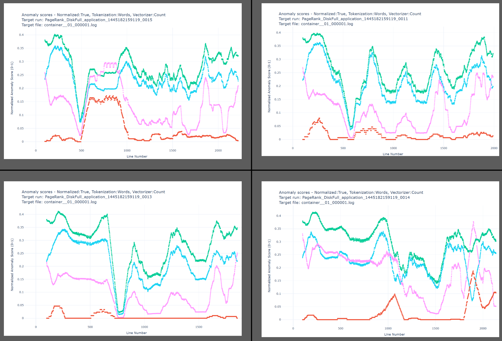 Again, I reviewed the top anomaly messages and out-of-vocabulary messages across the visualized logs. 

Two of the disk-full anomalies, highlighted on the screen, are not actually disk-full anomalies. Upon reviewing the log messages, I found no indication of the disk being full. Given this, I compared these two cases against the normal runs and the machine-down anomalies. The fingerprint analysis revealed that they were more similar to certain cases within the machine-down anomaly runs and not to the normal runs. Furthermore, their anomaly scores, as shown in the spreadsheet, were not low enough to classify them as normal runs. Based on this evidence, I conclude that these are machine-down anomalies.

For the two remaining cases, I found evidence in the logs that confirmed the disk was full. For visual check the [video](https://youtu.be/2GWZob7K5h0?t=376) - the timestamp points to correct location. 

As shown on the screen, both of these anomaly cases include stack traces indicating insufficient disk space. While not strictly log messages, these stack traces are printed alongside the log messages, confirming the disk-full issue. 

## Conclusions 
This concludes our somewhat accidental investigation into the incorrect labels. Initially, the purpose of this video was not to identify labeling issues but to demonstrate the LogDelta tool. However, during the demonstration, I became suspicious of some of the labels. Once I confirmed with certainty that the first incorrect label—where a "normal" run was actually a disk-full anomaly—was indeed mislabeled, it prompted a deeper investigation. As the saying goes, "When there’s one bug, you’re likely to find more."


| ID                 | Orig Label    | Fixed Label    |
|--------------------|---------------|----------------|
| 1445144423722_0024 | Normal        | Disk Full      |
| 1445182159119_0017 | Machine Down  | Normal         |
| 1445062781478_0020 | Machine Down  | Normal         |
| 1445182151478_0015 | Machine Down  | Disk Full      |
| 1445182159119_0013 | Disk Full     | Machine Down   |
| 1445182159119_0011 | Disk Full     | Machine Down   |


### Missing Details and Dead Ends
Many details and dead-ends were left out. For example, I performed checks using a script `find_string.py` to search for individual log messages in logs, which will be included as part of this demo package. 

Among the dead ends in this investigation was the use of distance-based measurements between logs. These included analyses of run distances measured using pairwise metrics such as Jaccard distance, Cosine distance, and Compression Distance. In principle, these analyses should yield results similar to those from anomaly detection and visualization-based methods. However, the distances between log files appeared too small, rendering the distance-based analysis inconclusive. You should check out the distance-based demonstrations in the other demo folders, as they may provide meaningful results in different contexts.

Finally, we did not investigate effect of different log enhancements like log parsing, e.g. [Drain](https://github.com/logpai/Drain3) or [Tipping](https://github.com/shshemi/tipping) using different tokenizers or vectorizers. 